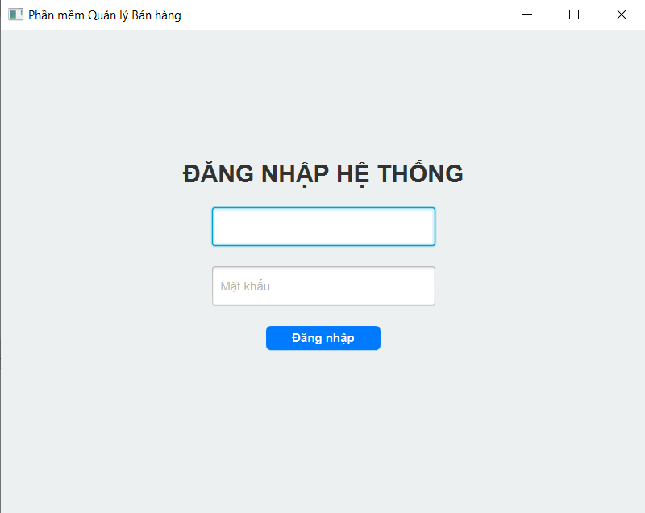
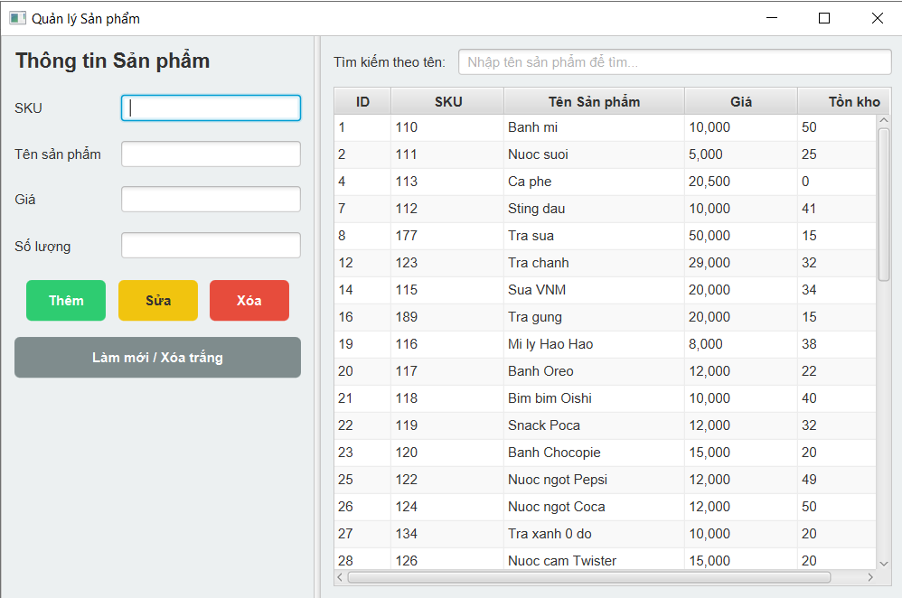
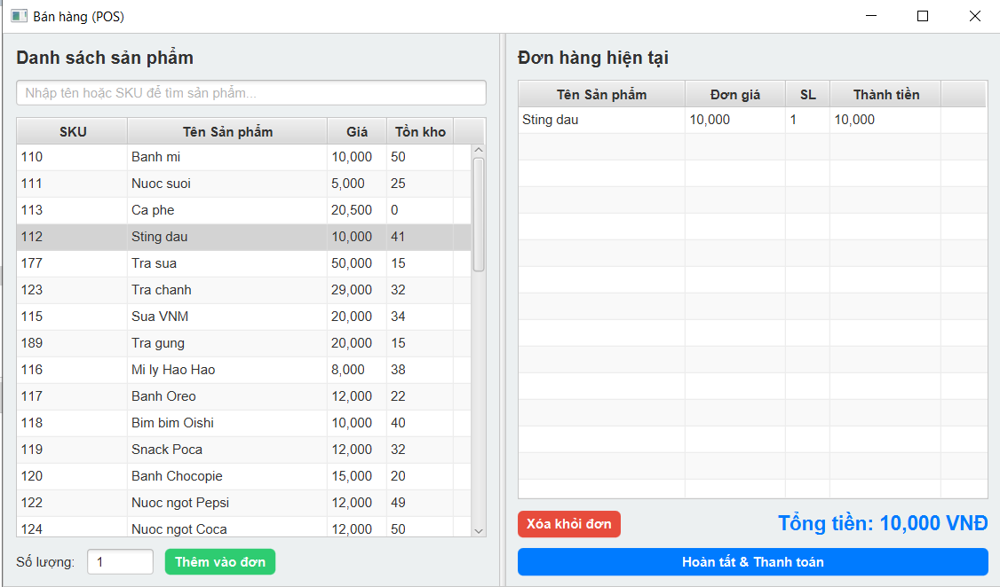
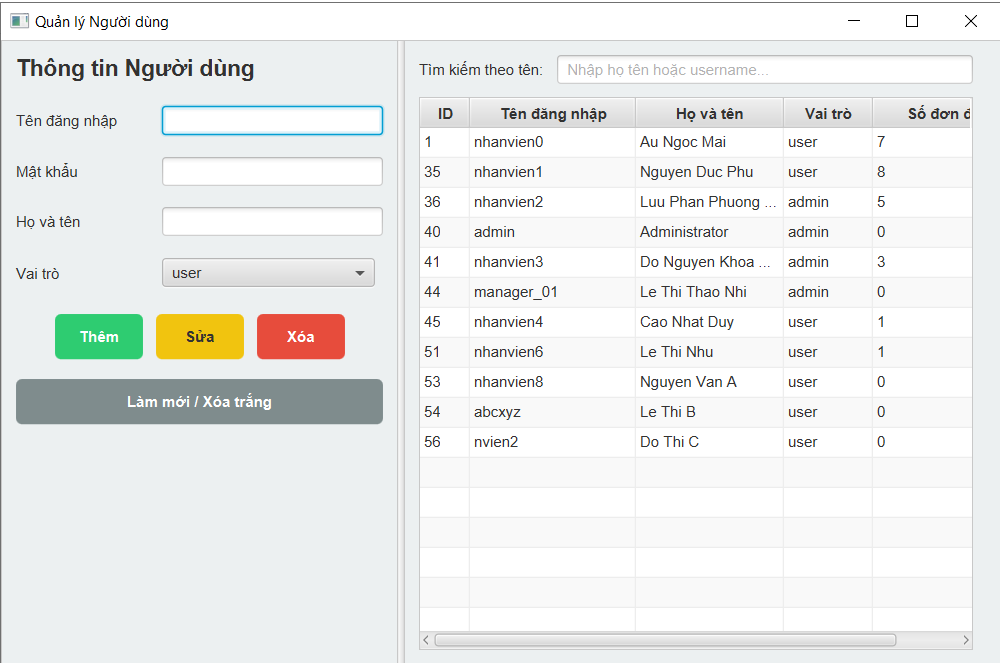
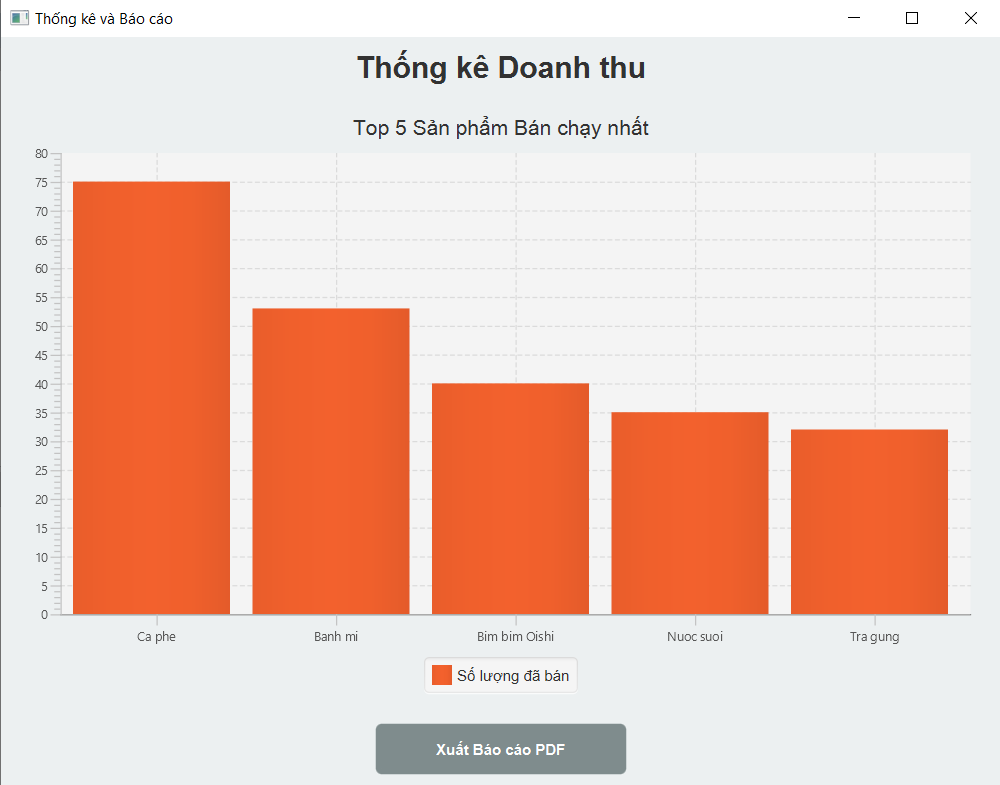
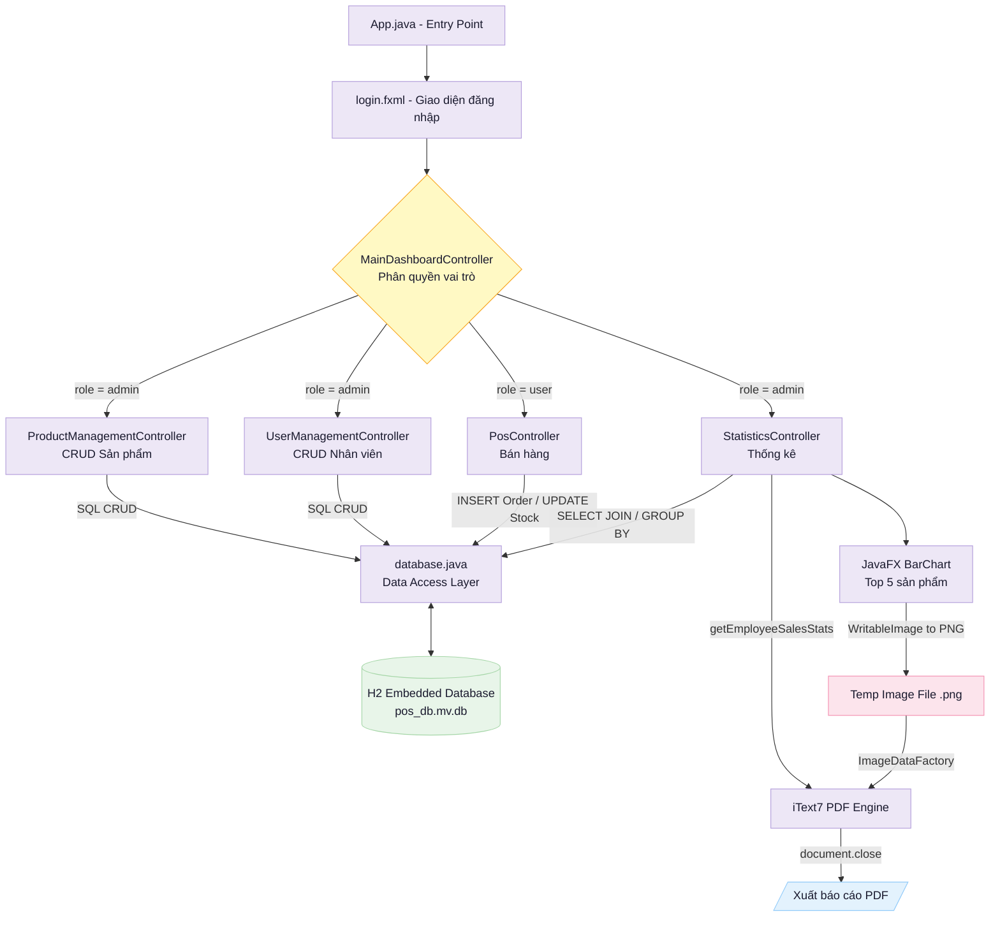
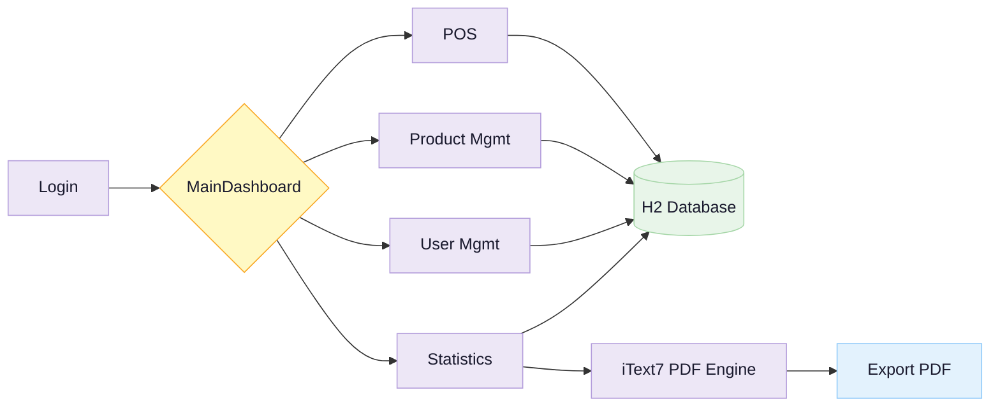

# Ứng dụng Quản lý Bán hàng POS 

**Đồ án cuối kỳ – Môn Lập trình Ứng dụng / Final Project - Applications Programming**

---

## Project Gallery

> Ứng dụng desktop quản lý bán hàng (Point of Sale) được xây dựng bằng Java & JavaFX, hỗ trợ phân quyền Admin/User, quản lý sản phẩm, xử lý giao dịch và xuất báo cáo PDF.
## Project Gallery


*Giao diện đăng nhập hệ thống và phân quyền xác thực / Login & Authentication View*


*Giao diện CRUD quản lý danh mục sản phẩm trong kho hàng / Product Management View*


*Giao diện màn hình tạo đơn hàng và xử lý giao dịch bán hàng / POS Transaction Dashboard*


*Giao diện CRUD quản lý tài khoản nhân viên và hiệu suất bán hàng / User Management View*


*Giao diện trực quan hóa doanh thu top 5 sản phẩm bán chạy nhất / Sales Statistics View*

---
**Kiến trúc hệ thống / System architecture**


**Luồng dữ liệu / Data flow**


---

## 🇻🇳 Tiếng Việt

### 1. Giới thiệu

Trong bối cảnh kinh tế hiện đại, việc tối ưu hóa quy trình bán hàng và quản lý hiệu quả là yếu tố then chốt. Đề tài **"Xây dựng Ứng dụng Quản lý Bán hàng (POS)"** được thực hiện với mục tiêu học hỏi và thử nghiệm, sử dụng Java, JavaFX và các thư viện bên ngoài để mô phỏng đầy đủ các chức năng của một hệ thống POS thực tế.

Ứng dụng hỗ trợ hai vai trò người dùng:
- **Admin (Quản lý)**toàn quyền quản lý sản phẩm, nhân viên, thống kê và xuất báo cáo.
- **User (Nhân viên)** – chỉ truy cập giao diện bán hàng POS.

### 2. Công nghệ sử dụng

| Thành phần | Công nghệ |
|---|---|
| Ngôn ngữ lập trình | Java (JDK 17+) |
| Framework giao diện | JavaFX 21.0.1 |
| IDE | Apache NetBeans |
| Cơ sở dữ liệu | H2 Database 2.2.224 (Embedded) |
| Quản lý dự án | Apache Maven |
| Thư viện PDF | iText7 (kernel, io, layout – v7.2.5) |
| Logging | SLF4J Simple 1.7.36 |
| Hỗ trợ | javafx-swing (chuyển đổi ảnh cho PDF) |

### 3. Tính năng chính

| Chức năng | Mô tả |
|---|---|
| 🔐 Đăng nhập & Phân quyền | Xác thực tài khoản, phân biệt vai trò Admin/User, điều hướng giao diện theo quyền |
| 📦 Quản lý Sản phẩm | CRUD đầy đủ – Thêm, Sửa, Xóa, Tìm kiếm theo tên hoặc SKU |
| 🛒 Bán hàng (POS) | Thêm sản phẩm vào giỏ hàng, kiểm tra tồn kho, tính tổng tiền, hoàn tất thanh toán |
| 👥 Quản lý Người dùng | CRUD tài khoản nhân viên, hiển thị số đơn hàng đã bán theo từng người (Admin only) |
| 📊 Thống kê & Báo cáo | Biểu đồ Top 5 sản phẩm bán chạy, xuất báo cáo PDF kèm bảng doanh thu theo nhân viên |

### 4. Cài đặt nhanh

#### Yêu cầu hệ thống
- Java JDK 17 trở lên
- Apache Maven 3.6+
- Apache NetBeans (khuyến nghị) hoặc IntelliJ IDEA với JavaFX plugin
- JavaFX SDK 21.0.1 (đã được Maven tự động tải qua `pom.xml`, không cần cài thủ công)

#### Backend (Build & Run)

```bash
# 1. Clone project từ GitHub
git clone https://github.com/DuyDo1006/POS-Sales-Management-System.git
cd UEH19

# 2. Build project với Maven
mvn clean install

# 3. Chạy ứng dụng
mvn javafx:run
```

#### Tài khoản

| Vai trò | Tên đăng nhập | Mật khẩu |
|---|---|---|
| Admin | `manager_01` | `manager` |
| Nhân viên | `nhanvien1` | `123` |

> ⚠️ **Lưu ý bảo mật:** Mật khẩu hiện được lưu dưới dạng plain text. Khuyến nghị triển khai SHA-256 hoặc bcrypt trước khi dùng trong môi trường thực tế.

---

## 🇬🇧 English

### 1. Introduction

**POS Sales Management Application** is a desktop application built for a university final project at UEH (University of Economics Ho Chi Minh City). It simulates core features of a real-world Point of Sale system using Java & JavaFX, with role-based access control, inventory management, and PDF report generation.

### 2. Tech Stack

| Component | Technology |
|---|---|
| Language | Java (JDK 17+) |
| UI Framework | JavaFX 21.0.1 |
| IDE | Apache NetBeans |
| Database | H2 Database 2.2.224 (Embedded mode) |
| Build Tool | Apache Maven |
| PDF Library | iText7 (kernel, io, layout – v7.2.5) |
| Logging | SLF4J Simple 1.7.36 |

### 3. Key Features

| Feature | Description |
|---|---|
| 🔐 Login & Role-based Access | Authenticates users, distinguishes Admin/User roles, adjusts UI accordingly |
| 📦 Product Management | Full CRUD – Add, Edit, Delete, Search by name or SKU |
| 🛒 POS Transaction | Add items to cart, validate stock, compute totals, complete payment |
| 👥 User Management | Manage staff accounts, view order count per employee (Admin only) |
| 📊 Statistics & PDF Report | Top 5 best-selling products bar chart, export PDF with per-employee sales table |

### 4. Quick Start

#### Requirements
- Java JDK 17+
- Apache Maven 3.6+
- Apache NetBeans (recommended) or IntelliJ IDEA with JavaFX plugin
- JavaFX SDK 21.0.1 (automatically downloaded by Maven via `pom.xml`, no manual installation required)

#### Backend

```bash
# 1. Clone project from GitHub
git clone https://github.com/DuyDo1006/POS-Sales-Management-System.git
cd UEH19

# 2. Build with Maven
mvn clean install

# 3. Run the application
mvn javafx:run
```

#### Default Accounts

| Role | Username | Password |
|---|---|---|
| Admin | `manager_01` | `manager` |
| Staff | `nhanvien1` | `123` |

> ⚠️ **Security Note:** Passwords are currently stored as plain text. It is recommended to implement SHA-256 or bcrypt hashing before deploying in a production environment.

---

## 📝 Ghi chú / Note

- Dữ liệu được lưu trong file `database/pos_db.mv.db` (H2 Embedded). Không cần cài đặt database server riêng.
- File database sẽ được tự động tạo khi chạy lần đầu nếu chưa tồn tại.
- Chức năng xuất PDF lưu file tại thư mục gốc của project theo mặc định.
- Project được phát triển phục vụ mục đích học thuật – một số tính năng như mã hóa mật khẩu, quản lý khách hàng (CRM), và thống kê theo thời gian (ngày/tháng/năm) sẽ được mở rộng trong các phiên bản sau.

- Data is stored in `database/pos_db.mv.db` (H2 Embedded). No separate database server installation required.
- The database file will be created automatically on first run if it does not exist.
- PDF export saves the file to the project root directory by default.
- This project was developed for academic purposes — features such as password hashing, customer management (CRM), and time-based statistics (daily/monthly/yearly) will be expanded in future versions.

---

